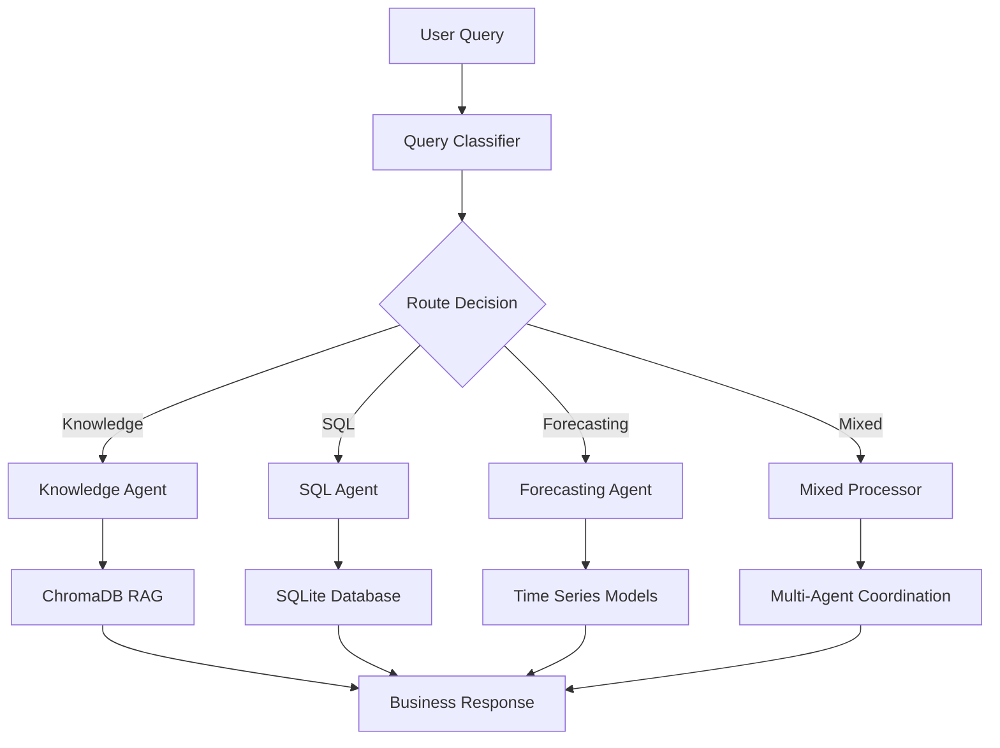

# 🚀 Multi-Agent SQL RAG Workflow System

[](https://www.python.org/downloads/)
[](https://github.com/langchain-ai/langgraph)
[](https://opensource.org/licenses/MIT)

A sophisticated multi-agent AI system that combines **SQL querying**, **knowledge retrieval**, and **time series forecasting** into a unified workflow using LangGraph and LLM orchestration.

## 🎯 **Overview**

This system intelligently routes user queries to specialized AI agents:

- 🧠 **Knowledge Agent**: RAG-based system for database schema and business rules
- 🔍 **SQL Agent**: Natural language to SQL query generation and execution  
- 📈 **Forecasting Agent**: Advanced time series forecasting with business insights
- 🎛️ **Workflow Coordinator**: LangGraph-based orchestration and routing

## ✨ **Key Features**

- **Multi-Modal Query Handling**: Automatically routes queries to appropriate specialized agents
- **Advanced Forecasting**: Exponential smoothing with multiple aggregation levels (daily, weekly, monthly)
- **RAG-Enhanced SQL**: Context-aware SQL generation using vector database knowledge
- **Business Intelligence**: Transforms technical results into actionable business insights
- **Robust Error Handling**: Graceful degradation with multiple fallback mechanisms
- **Interactive CLI**: User-friendly command-line interface for real-time queries

## 🏗️ **System Architecture**



## 🛠️ **Technology Stack**

- **Orchestration**: LangGraph for workflow management
- **LLM**: Groq API (Llama 3-8B) for fast inference
- **Vector Database**: ChromaDB for knowledge retrieval
- **Time Series**: Statsmodels for forecasting
- **Database**: SQLite for data storage
- **ML Libraries**: Scikit-learn, Pandas, NumPy

## 📋 **Prerequisites**

- Python 3.8 or higher
- Groq API key (free at [console.groq.com](https://console.groq.com/))
- Git for cloning the repository

## 🚀 **Quick Start**

### 1. Clone the Repository
```bash
git clone https://github.com/your-username/multi-agent-workflow-system.git
cd multi-agent-workflow-system
```

### 2. Install Dependencies
```bash
pip install -r requirements.txt
```

### 3. Environment Setup
Create a `.env` file in the root directory:
```env
GROQ_API_KEY=your_groq_api_key_here
```

### 4. Prepare Your Data
1. Place your CSV file in the project directory
2. Update the file path in `csv_to_sql.py`:
```python
csv_file = 'path/to/your/Sample - Superstore.csv'
```

### 5. Initialize Database
```bash
python csv_to_sql.py
```

### 6. Run the System
```bash
python main.py
```

## 📊 **Sample Queries**

### Knowledge Agent
```
"What columns are in the sales data table?"
"Explain the business rules for customer segments"
"How do I join sales data with forecasts?"
```

### SQL Agent  
```
"Show me top 5 customers by sales"
"Analyze sales performance by region"
"What are the monthly sales trends?"
```

### Forecasting Agent
```
"Forecast sales for the next 30 days"
"Predict weekly sales for the West region"
"Generate a 3-month sales forecast"
"What will be the sales trend for next quarter?"
```

### Mixed Queries
```
"Analyze regional performance and forecast next month's sales"
"Show me historical trends and predict future growth"
```

## 📁 **Project Structure**

```
multi-agent-workflow-system/
├── main.py                    # Main application with all agents
├── csv_to_sql.py             # Database initialization script
├── Sample - Superstore.csv   # Sample dataset (Superstore sales data)
├── requirements.txt          # Python dependencies
├── .env                      # Environment variables (create this)
├── .gitignore               # Git ignore file
├── README.md                # This file
└── superstore.db            # SQLite database (created after setup)
```

## 🔧 **Configuration**

### Database Configuration
The system uses SQLite by default. To use other databases, modify the `SuperstoreDatabaseLoader` class in `csv_to_sql.py`:

```python
# PostgreSQL
loader = SuperstoreDatabaseLoader(
    db_type='postgresql',
    host='localhost',
    database='superstore',
    user='username',
    password='password'
)

# MySQL
loader = SuperstoreDatabaseLoader(
    db_type='mysql',
    host='localhost',
    database='superstore',
    user='username',
    password='password'
)
```

### LLM Configuration
Change the LLM model in `main.py`:
```python
self.llm = ChatGroq(
    groq_api_key=api_key,
    model_name="llama3-70b-8192",  # Larger model for better performance
    temperature=0.1
)
```

## 📈 **Forecasting Capabilities**

### Supported Aggregation Levels
- **Daily**: High-resolution forecasts with weekly seasonality
- **Weekly**: Smooth trends with monthly seasonality  
- **Monthly**: Long-term trends with yearly seasonality

### Forecasting Methods
- **Exponential Smoothing**: Advanced statistical model with trend and seasonality
- **Moving Average**: Fallback method for small datasets
- **Confidence Intervals**: Statistical bounds for predictions

### Business Intelligence
- Growth rate analysis
- Trend identification
- Risk assessment
- Actionable recommendations

## 🎛️ **Advanced Usage**

### Custom Knowledge Base
Add domain-specific knowledge to the RAG system:

```python
# In KnowledgeAgent._load_knowledge_base()
custom_docs = [
    {
        "id": "custom_business_rules",
        "content": "Your custom business rules and insights...",
        "metadata": {"type": "custom", "domain": "retail"}
    }
]
```

### Extending Forecasting
Add new forecasting models:

```python
# In AdvancedForecastingAgent
def arima_forecast(self, df: pd.DataFrame, periods: int = 30) -> ForecastResult:
    # Implement ARIMA model
    pass
```

### Custom SQL Patterns
Extend SQL generation capabilities:

```python
# In KnowledgeAgent knowledge base
"advanced_sql_patterns": """
    Complex analytics patterns:
    - Window functions: ROW_NUMBER() OVER (PARTITION BY category ORDER BY sales DESC)
    - CTEs: WITH ranked_products AS (SELECT ...) SELECT * FROM ranked_products
"""
```

## 🧪 **Testing**

### Unit Tests
```bash
python -m pytest tests/
```

### Integration Tests
```bash
python -m pytest tests/integration/
```

### Manual Testing
Use the interactive CLI to test various query types:
```bash
python main.py
```

## 🐛 **Troubleshooting**

### Common Issues

#### 1. "GROQ_API_KEY not found"
- Ensure `.env` file exists in the root directory
- Verify the API key is correct and active

#### 2. "Database connection failed"
- Check if `superstore.db` exists (run `csv_to_sql.py` first)
- Verify CSV file path is correct

#### 3. "ChromaDB collection error"
- Delete any existing ChromaDB data and restart
- Check write permissions in the project directory

#### 4. "Forecasting model convergence failed"
- System automatically falls back to simpler models
- Check if you have sufficient historical data (> 10 data points)

### Debug Mode
Enable detailed logging:
```python
logging.basicConfig(level=logging.DEBUG)
```

## 📊 **Performance Metrics**

### Typical Performance
- **Query Classification**: ~100ms
- **SQL Generation**: ~200-500ms
- **Forecasting**: ~1-3 seconds (depending on data size)
- **Knowledge Retrieval**: ~50-100ms

### Optimization Tips
- Use appropriate aggregation levels for forecasting
- Limit SQL result sets with LIMIT clauses
- Cache frequently accessed knowledge
- Use batch processing for multiple forecasts

## 🤝 **Contributing**

We welcome contributions! Here's how to get started:

1. **Fork the repository**
2. **Create a feature branch**: `git checkout -b feature/amazing-feature`
3. **Make your changes**
4. **Add tests**: Ensure your changes are tested
5. **Commit your changes**: `git commit -m 'Add amazing feature'`
6. **Push to the branch**: `git push origin feature/amazing-feature`
7. **Open a Pull Request**

### Development Setup
```bash
# Install development dependencies
pip install -r requirements-dev.txt

# Run tests
pytest

# Code formatting
black .
isort .

# Linting
flake8 .
```

### Code Style
- Follow PEP 8 guidelines
- Use type hints where appropriate
- Add docstrings for all public methods
- Keep functions focused and single-purpose

## 📜 **License**

This project is licensed under the MIT License - see the [LICENSE](LICENSE) file for details.

## 🙏 **Acknowledgments**

- **LangChain & LangGraph**: For the excellent agent orchestration framework
- **Groq**: For providing fast LLM inference
- **ChromaDB**: For the vector database capabilities
- **Statsmodels**: For robust time series forecasting
- **Superstore Dataset**: Sample data for demonstration

---

**Built with ❤️ by [Your Name]**

*If you find this project useful, please consider giving it a ⭐ on GitHub!*
